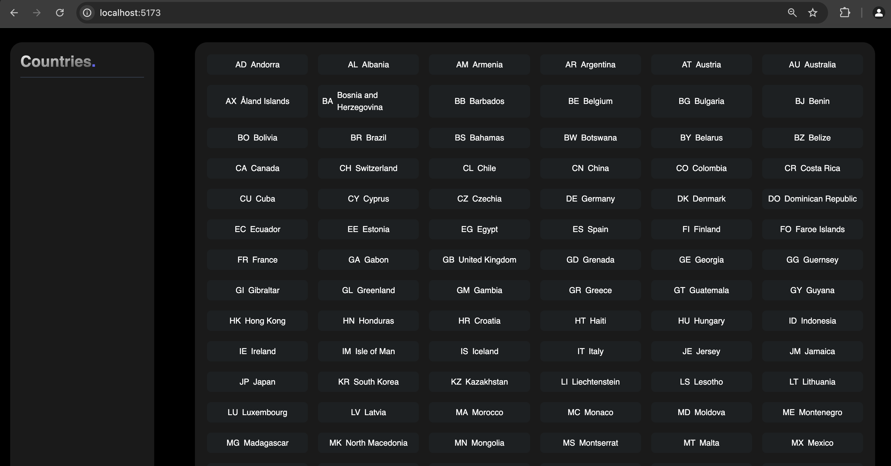
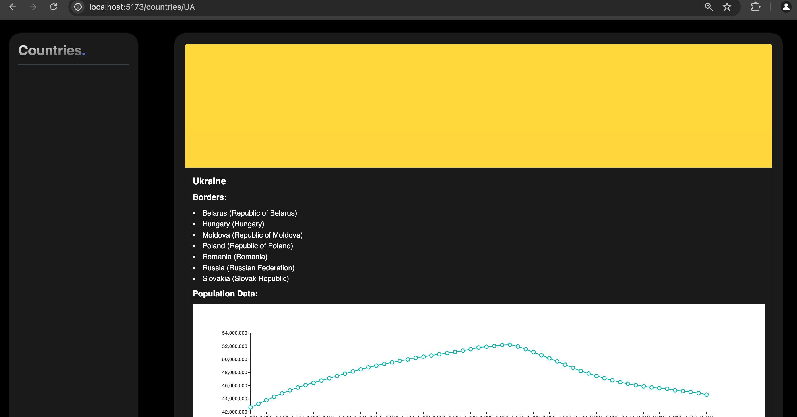

## Run the backend application

1. Open a terminal.
3. run npm i to install all dependencies.
4. Type node `index.js` and press enter.
5. Go to your browser and paste this URL for all the countries.
  - http://localhost:3000/api/countries
6. For detailed information about a country using its code:
  - http://localhost:3000/api/country/:code

## Run de front end application

1. Open a new terminal (don't close the one running the backend app) and type `npm i` to install all dependencies.
2. Once it's done installing, type `npm run dev` it should start a new localhost server.
3. Open a new browser tab and type `http://localhost:5173/` in the search bar.
4. It should display all the countries and the country code.

5. Click on any of the names of the country and it will display the country info.

CLICK ON THE "COUNTRIES" BUTTON TO RETURN TO THE HOME PAGE